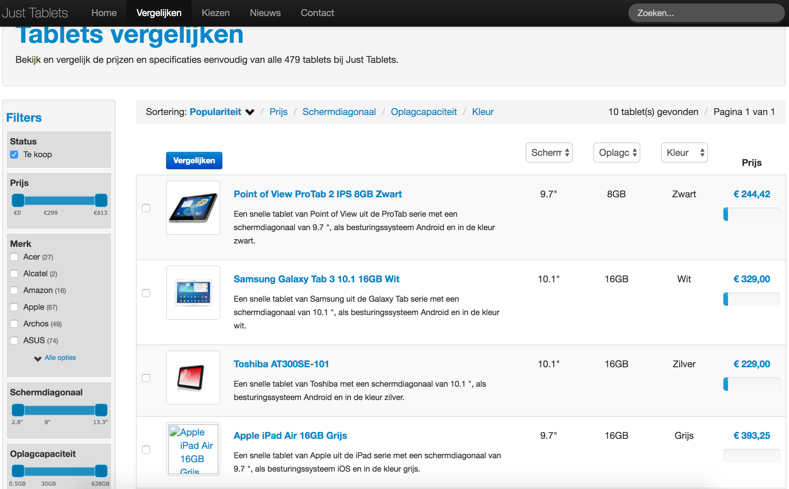

# Just Tablets

Back in 2012 I've created a Dutch tablet comparison website called Telbat (tablet in reverse), later I've changed the name to Just Tablets. The porpuse was to experiment with Icecat and earn money from affiliate marketing, sadly that didn't work out. The website also ran some time on vergelijken.tablet.nl as a pilot. Until somewhere in 2016 the website was running on justtablets.nl. You can still see it with the Way Back Machine (click on the screenshot).

The whole comparison part is inspired by the [Tweakers Pricewatch](https://tweakers.net/categorie/822/tablets/producten/) and I'm getting the product information from [Icecat](http://icecat.nl/)

## Why do you share this?

The project is abandoned by me, so maybe someone is interested in it, especially the Icecat integration part. Fork it and build something great! I did my very best back then but when I look at it now, it's not that well written. But hey, everyone started somewhere right? And look at the Wordpress code, it can always be worse. You can find English comments almost everywhere in the code, so it's readable.

## Technical information

- It's build with the [CodeIgniter PHP framework](https://codeigniter.com/), version 2.1.3
- Frontend is based on [Bootstrap 2](http://getbootstrap.com/2.3.2/)

## Getting it up-and-running

- Check all variables in the config files in `public/application/config/`
- Import the database `database.sql`

## You're just here for the Icecat part?

Check out my blog posts (written in Dutch):

- https://royduineveld.nl/icecat-xml-verwerken/
- https://royduineveld.nl/icecat-xml-verwerken-deel-2-de-array-weergeven/

And try the demo: https://royduineveld.nl/demos/icecat-xml/

## Questions? Bugs?

It's a old project so I'm not supporting it, but feel free to open a issue and lets see what I can do for you.

## License
[MIT](LICENSE.txt)
